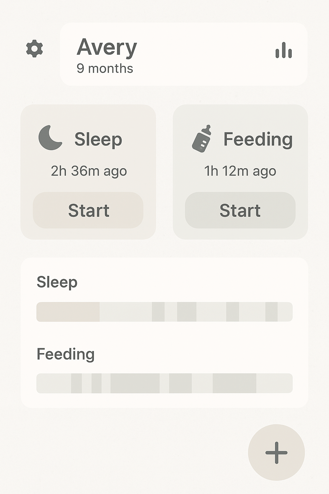

# Журнал разработки
Несерьёзные заметки, как продвигается проект

### 2025-08-19
Добавила в таймер сохранение предыдущих секций. Вообще говоря, следующий шаг - сделать сохраненение в файл и отображение истории, но меня уже на этом этапе раздражает, что я не понимаю, как это отображать. Можно взять тот вариант, что у меня сейчас в приложении или просто самый простой, но по-хорошему надо бы прокликать конкурентов и нарисовать своё видение
Почему-то сожгла лимиты на Cursor и неясно, когда они вернутся. Перешла на RooCode с gemini.

### 2025-08-17
Есть полчаса дописать заметки по вчерашним изысканиям - конечно, хочется быстрее двинуться к коду, но сейчас обучение важнее.
В уже готовом Activity сделала таймер, сначала совсем простой, а потом все-таки удалось в MVVM больше погрузиться и унести логику из Activity. Потрогала корутины, пока конечно не всё понятно, но что-то начинает получаться. Думаю, что когда будет время без ноутбука - можно будет попробовать описать функционал приложения и порисовать картинки, как всё разместить.

Нарисовала в GPT как может выглядеть главный экран. Ничего особенно сложного не хочется, главное - быстрота доступа к основным функциям  

### 2025-08-16
Попыталась повайб-кодить, но снова облом - версии котлина и compose должны как-то правильно совпадать, cursor этого не понимает. Возвращаемся назад.
### 2025-08-14
Сделала инит-версию, без всего. Оказалось, что проще для этого использовать шаблоны android studio, все-таки cursor генерит что-то большое, красивое и вообще не рабочее. Чтобы разобраться с gradle, пришлось использовать студию - и потом уже буду допиливать
